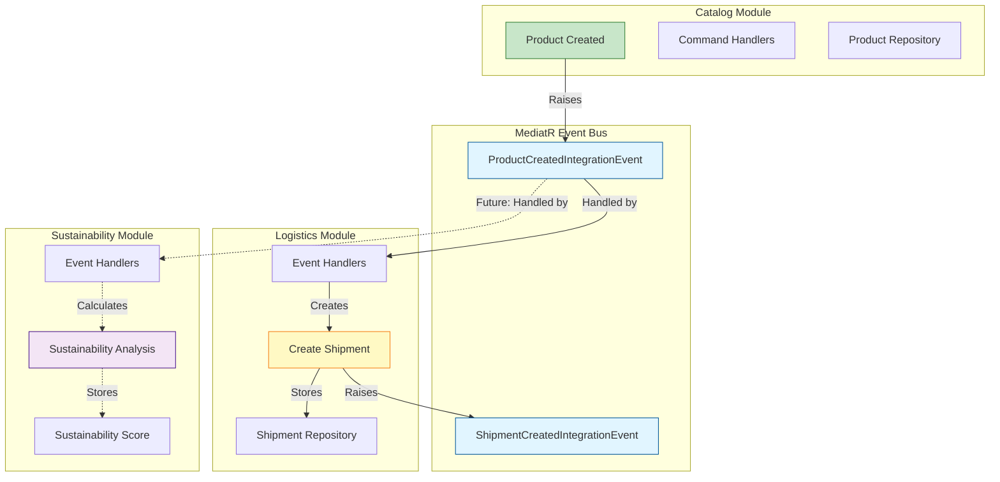

# EcoSync Project

EcoSync is a modular monolith backend application built with .NET 9 and C# 13, applying Domain-Driven Design (DDD) principles and Clean Architecture.

## Architecture Overview

### Modular Monolith
The application is organized into four distinct modules:
- **Catalog**: Product management and catalog functionality
- **Logistics**: Shipment and delivery management
- **Sustainability**: Environmental impact tracking and sustainability scoring
- **Identity**: User authentication and authorization

### Module Communication via MediatR

The modules communicate with each other through integration events using MediatR. This ensures loose coupling between modules while maintaining consistency.



### Clean Architecture
Each module follows Clean Architecture with four layers:
- **Domain**: Core business logic, aggregates, value objects, and domain events
- **Application**: Use cases, commands, queries, and handlers
- **Infrastructure**: Data persistence, external services, and technical implementations
- **API**: HTTP endpoints and module registration

### DDD Patterns
- **Aggregates**: Encapsulate business rules and maintain consistency
- **Value Objects**: Immutable objects that describe domain concepts
- **Domain Events**: Capture important business events within aggregates
- **Repositories**: Abstract data access for aggregates
- **Outbox Pattern**: Ensure reliable event publishing for inter-module communication

## Technology Stack

- **.NET 9** with C# 13
- **PostgreSQL**: Primary database using EF Core
- **Redis**: Caching layer
- **MediatR**: In-process messaging for CQRS and event handling
- **FluentValidation**: Input validation
- **Mapster**: Object mapping
- **Serilog**: Structured logging
- **Swagger/OpenAPI**: API documentation

## Project Structure

```
src/
├── BuildingBlocks/
│   └── EcoSync.BuildingBlocks/          # Shared domain primitives and abstractions
├── EcoSync.IntegrationEvents/           # Shared integration event contracts
├── Modules/
│   ├── Catalog/
│   │   ├── Domain/                      # Product aggregate, value objects
│   │   ├── Application/                 # Commands, queries, handlers
│   │   ├── Infrastructure/              # EF Core, repositories
│   │   └── API/                         # Endpoints
│   ├── Logistics/
│   ├── Sustainability/
│   └── Identity/
└── API/
    └── EcoSync.API/                     # API host project
```

## Getting Started

### Prerequisites
- [.NET 9 SDK](https://dotnet.microsoft.com/download/dotnet/9.0)
- [Docker](https://www.docker.com/get-started) and Docker Compose
- PostgreSQL (if running without Docker)

### How to Run with Docker

The easiest way to run EcoSync is using Docker Compose, which will start all required services (API, PostgreSQL, Redis):

1. **Clone the repository**
```bash
git clone https://github.com/husseinbbassam/eco-sync.git
cd eco-sync
```

2. **Start all services with Docker Compose**
```bash
docker-compose up -d
```

This command will:
- Build the EcoSync API Docker image
- Start PostgreSQL database on port 5432
- Start Redis cache on port 6379
- Start the API on port 5000
- Automatically run database migrations
- Seed the database with 10 sample products

3. **Access the application**
- API: http://localhost:5000
- Swagger UI: http://localhost:5000/swagger
- Health Check: http://localhost:5000/health

4. **View logs**
```bash
# View all logs
docker-compose logs -f

# View API logs only
docker-compose logs -f api
```

5. **Stop all services**
```bash
docker-compose down
```

6. **Stop and remove all data (including database volumes)**
```bash
docker-compose down -v
```

### Running Locally (Without Docker)

1. **Ensure PostgreSQL is running**

2. **Update connection string in `src/API/EcoSync.API/appsettings.json`**
```json
{
  "ConnectionStrings": {
    "Database": "Host=localhost;Port=5432;Database=ecosync;Username=postgres;Password=your_password"
  }
}
```

3. **Run the API**
```bash
cd src/API/EcoSync.API
dotnet run
```

The application will automatically:
- Run database migrations
- Seed the database with sample products (if not already present)
- Start the API on http://localhost:5000

## API Endpoints

### Catalog Module

#### Products
- `POST /api/catalog/products` - Create a new product
- `GET /api/catalog/products/{id}` - Get product by ID
- `GET /api/catalog/products` - List products (with filters)
- `PUT /api/catalog/products/{id}/price` - Update product price

## Module Features

### Catalog Module
- Product management with categories
- Stock tracking
- Price management
- Product activation/deactivation

### Logistics Module
- Shipment creation and tracking
- Pending shipment creation via integration events
- Integration with Catalog module via ProductCreatedIntegrationEvent
- Shipment status management (Pending, InTransit, Delivered, Cancelled)

### Sustainability Module (Planned)
- Carbon footprint calculation
- Sustainability score computation
- Environmental impact reports
- Integration with logistics data

### Identity Module (Planned)
- User registration and authentication
- Role-based access control
- JWT token management

## Development

### Building the Solution
```bash
dotnet build
```

### Running Tests (when available)
```bash
dotnet test
```

### Database Migrations
```bash
cd src/Modules/Catalog/Infrastructure/EcoSync.Modules.Catalog.Infrastructure
dotnet ef migrations add InitialCreate --context CatalogDbContext
dotnet ef database update --context CatalogDbContext
```

## Architecture Decisions

### Why Modular Monolith?

We chose a modular monolith architecture over microservices for several strategic reasons:

1. **Simplicity**: Single deployment unit reduces operational complexity
2. **Development Speed**: Easier to refactor and evolve the codebase
3. **Performance**: In-process communication is faster than network calls
4. **Consistency**: ACID transactions across modules when needed
5. **Future Flexibility**: Can be split into microservices later if needed

### Key Design Decisions

#### 1. Clean Architecture with DDD
- **Decision**: Organize each module using Clean Architecture layers with DDD tactical patterns
- **Rationale**: Separates business logic from infrastructure concerns, making the code more maintainable and testable
- **Trade-off**: More initial setup complexity, but long-term maintainability gains

#### 2. MediatR for Inter-Module Communication
- **Decision**: Use MediatR for both in-module (commands/queries) and inter-module (integration events) communication
- **Rationale**: 
  - Decouples modules from each other
  - Provides a consistent messaging pattern
  - Enables the Outbox pattern for reliable event delivery
- **Trade-off**: Additional abstraction layer, but significantly improves module independence

#### 3. Integration Events vs Direct References
- **Decision**: Modules communicate via integration events, not direct domain references
- **Rationale**: 
  - Maintains bounded context boundaries
  - Prevents tight coupling between modules
  - Allows modules to evolve independently
- **Implementation**: Shared integration event contracts in a separate project

#### 4. Outbox Pattern for Event Publishing
- **Decision**: Store events in an outbox table and publish them asynchronously
- **Rationale**: 
  - Guarantees at-least-once delivery
  - Maintains consistency between database changes and event publishing
  - Prevents lost events due to failures
- **Trade-off**: Eventual consistency instead of immediate consistency

#### 5. One Database, Multiple Schemas
- **Decision**: Use PostgreSQL with separate schemas per module (e.g., `catalog`, `logistics`)
- **Rationale**: 
  - Logical separation while maintaining ACID guarantees
  - Easier to manage than multiple databases
  - Can be split into separate databases later if needed
- **Trade-off**: Not as isolated as separate databases, but simpler to operate

#### 6. CQRS Pattern
- **Decision**: Separate command (write) and query (read) operations
- **Rationale**: 
  - Optimizes reads and writes independently
  - Allows different models for reading and writing
  - Scales read and write concerns separately
- **Implementation**: Commands for writes, Queries for reads, both via MediatR

#### 7. Value Objects and Aggregates
- **Decision**: Use DDD tactical patterns extensively
- **Rationale**: 
  - Value Objects ensure invariants (e.g., Money can't be negative)
  - Aggregates maintain consistency boundaries
  - Domain events capture business-relevant occurrences
- **Example**: `Money` as a value object, `Product` as an aggregate root

#### 8. Database-per-Module Migrations
- **Decision**: Each module manages its own migrations
- **Rationale**: 
  - Modules own their data schema
  - Independent evolution of database schemas
  - Clear ownership boundaries
- **Implementation**: Separate DbContext per module with individual migration histories

### Future Considerations

- **API Gateway**: If we split into microservices, add an API gateway for routing
- **Event Bus**: Replace in-process MediatR with RabbitMQ or Kafka for distributed events
- **CQRS Reads**: Consider read-specific databases (e.g., Elasticsearch) for complex queries
- **Service Mesh**: Add Istio or Linkerd if moving to Kubernetes-based microservices

## Contributing

Contributions are welcome! Please follow the established patterns and architecture principles.

## License

This project is licensed under the MIT License.
